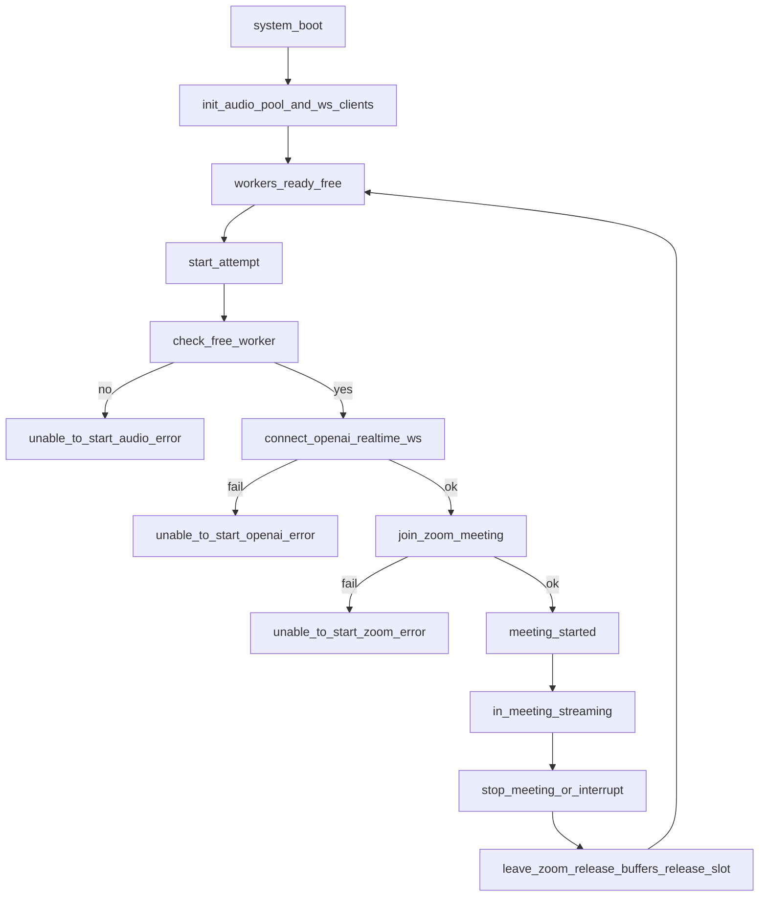

# NULLXES + C++ Micro-client Handoff Bundle (v1)

PDF-friendly master index для согласования реализации между NULLXES и командой C++.

---

## 1. Документы пакета

1. Canonical contract:
   - `docs/NULLXES_Integration_Pack_v1.md`
2. Архитектура micro-client:
   - `docs/NULLXES_Microclient_Integration_v1.md`
3. Audio plane (as-is + target):
   - `docs/audio_protocol.md`
4. Ops runbook:
   - `docs/NULLXES_Microclient_Runbook_v1.md`
5. Error/acceptance для C++ скелета:
   - `examples/cpp_microclient/docs/error_matrix.md`
   - `examples/cpp_microclient/docs/acceptance_checklist.md`

---

## 2. Scope, закрытый этим пакетом

- Разделы 7.1–7.4 (процессы): инициализация, старт встречи, stop, shutdown.
- Раздел 8 (входящие control команды).
- Раздел 9 (исходящие control команды).
- Раздел 10 (OpenAI realtime STT, append, VAD, partial/final transit).

---

## 3. Process summary (7.1–7.4)

---

## 4. Canonical payload decisions

- `aiSystemId` (control) и `session_id` (text) обозначают одну и ту же сессию UUIDv4.
- В text канале транзитом идут **оба** вида STT:
  - `text_partial`
  - `text_final`
- `text_final` — authoritative для логики; `text_partial` — UX/оперативный текст.
- `realtime_error` включен как отдельный тип для telemetry/recovery.

---

## 5. Zoom SDK mapping статус

Поля из backend Zoom API, которые должны быть окончательно согласованы с заказчиком:

- `meetingUrl` / join url
- `meetingId`
- `passcode`
- `signature/token` (если требуется в выбранном Linux SDK path)
- `displayName`

Пока этот payload не зафиксирован, таблица mapping считается `TBD`.

Ref:
- [Zoom Linux Meeting SDK: start/join/leave](https://developers.zoom.us/docs/meeting-sdk/linux/get-started/meetings/#start-a-meeting)

---

## 6. Audio stack decision record

В рамках этого handoff-пакета поддерживаются оба режима:

- PulseAudio native
- PipeWire (Pulse compatibility)

Практическое правило:

- если окружение уже на PipeWire, использовать pulse-compatible слой и валидировать пул виртуальных устройств;
- если окружение на PulseAudio native, использовать его как прямой backend.

---

## 7. Definition of Done (documentation phase)

- Нет противоречий между payload-контрактами и процессной схемой.
- Разделы 7–10 покрыты примерами событий.
- Error matrix определяет все `unable_to_start` / `meeting_interrupted` ветки.
- Есть runbook install/start/stop/restart/autostart.
- Есть acceptance template на 10+ concurrent sessions.

