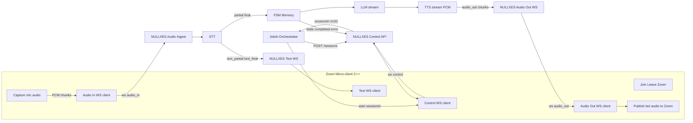

# NULLXES <-> Zoom Micro-client Integration (v1)

Документ фиксирует целевую схему интеграции с Zoom микро-клиентом (C++), чтобы убрать зависимость от браузерных аудио-хаков и сделать канал управления/медиа предсказуемым.

---

## 1. Цель

- NULLXES остается "brain": STT -> FSM/Memory -> LLM -> TTS.
- Zoom микро-клиент (C++) берет на себя media runtime:
  - вход/выход в Zoom встречу,
  - работа с аудиоустройствами,
  - публикация TTS-аудио в Zoom uplink,
  - отправка входящего аудио в NULLXES.

---

## 2. Рекомендуемая топология каналов

Рекомендуемый вариант: раздельные каналы по ответственности.

1. `control` WS: lifecycle, статусы, ошибки, команды оператора.
2. `audio_in` WS: PCM от микро-клиента в NULLXES (кандидатская речь).
3. `audio_out` WS: PCM от NULLXES в микро-клиент (голос бота в Zoom).
4. `text` WS (опционально): зеркалирование partial/final/agent-text для UI.

Причина: проще отладка и масштабирование, чем "все в одном сокете", и без усложнения "по WS-серверу на каждую сессию".

---

## 3. Идентификатор сессии

- `sessionId`: строка `UUID v4`.
- Обязателен в handshake и в каждом сообщении.
- Источник истины: `POST /sessions` возвращает `sessionId`.

---

## 4. Sequence (target)

1. Orchestrator вызывает `POST /sessions`.
2. NULLXES возвращает `sessionId`.
3. Микро-клиент открывает WS:
   - `/ws/control?sessionId=<uuid>`
   - `/ws/audio_in?sessionId=<uuid>`
   - `/ws/audio_out?sessionId=<uuid>`
   - `/ws/text?sessionId=<uuid>` (если нужен live UI)
4. Микро-клиент входит в Zoom встречу.
5. Микро-клиент отправляет входящий аудиопоток в `audio_in`.
6. NULLXES выполняет STT -> FSM -> LLM -> TTS.
7. NULLXES отдает PCM чанки в `audio_out`.
8. Микро-клиент публикует `audio_out` как микрофонный uplink в Zoom.
9. Статусы/ошибки идут через `control`.

---

## 5. Форматы сообщений (рекомендуемые)

Общие поля (для всех WS-событий):

- `type` (string)
- `sessionId` (uuid string)
- `seq` (integer, монотонно в рамках сессии)
- `tsMs` (unix ms)

### 5.1 Text partial

```json
{
  "type": "text_partial",
  "sessionId": "uuid-v4",
  "seq": 101,
  "tsMs": 1744211105000,
  "payload": {
    "event_id": "event_2122",
    "type": "conversation.item.input_audio_transcription.delta",
    "item_id": "item_003",
    "content_index": 0,
    "delta": "Hello,"
  }
}
```

### 5.2 Text final

```json
{
  "type": "text_final",
  "sessionId": "uuid-v4",
  "seq": 102,
  "tsMs": 1744211105600,
  "isFinal": true,
  "payload": {
    "event_id": "event_2123",
    "type": "conversation.item.input_audio_transcription.completed",
    "item_id": "item_003",
    "content_index": 0,
    "transcript": "Hello, how are you?"
  }
}
```

### 5.3 Realtime error

```json
{
  "type": "realtime_error",
  "sessionId": "uuid-v4",
  "seq": 245,
  "tsMs": 1744211105123,
  "origin": "openai_realtime",
  "recoverable": true,
  "error": {
    "code": "rate_limit",
    "message": "Realtime rate limit exceeded",
    "eventId": "event_9a2",
    "itemId": "item_003"
  },
  "raw": {}
}
```

---

## 6. Что считать authoritative

- `text_partial`: только UX/индикатор/живые субтитры.
- `text_final`: единственный authoritative триггер бизнес-логики:
  - запись в память и transcript,
  - запуск следующего LLM turn,
  - latency-метрики.

Итог: partial-only как единственный контракт не рекомендуется.

---

## 7. Commit/границы реплики

### As-is в текущем коде (realtime_ws)

- `input_audio_buffer.append` отправляется потоково.
- `input_audio_buffer.commit` в текущей реализации уходит в конце входного потока (end-of-stream).

### Target для прод-интеграции

- Перейти на utterance-based commit по VAD.
- Базовые пороги:
  - `rms_threshold`: `0.015`
  - `silence_ms`: `450`
  - `min_utterance_ms`: `120`
  - `max_utterance_ms`: `28000`

---

## 8. Формат аудио (рекомендуемый)

Для `audio_in` и `audio_out`:

- PCM16 LE
- mono
- 16000 Hz
- кадр 20 ms (320 samples, 640 bytes до base64)

Если нужен 24k для конкретного транспорта, договориться отдельно и делать ресемпл на границе канала.

---

## 9. Многопоточность / concurrency

- Целевая параллельность: минимум 10 сессий одновременно.
- Не поднимать отдельный WS сервер на каждую сессию.
- Один endpoint на тип канала + маршрутизация по `sessionId`.
- На каждую сессию держать независимые очереди/состояние.

---

## 10. Надежность и порядок

Рекомендуется обязательно:

- heartbeat ping/pong;
- close codes (пример: 4404 unknown session, 4409 duplicate session connection);
- дедуп по `(sessionId, seq)`;
- порядок для STT final по `item_id` (потому что completed могут приходить не строго по времени между разными turn).

---

## 11. Состояния control-канала (минимум)

Рекомендуемые события:

- `session_state` (`starting`, `joining`, `in_meeting`, `closing`, `closed`)
- `session_completed` (`natural`, `time_up`, `operator_stop`, `error`)
- `realtime_error`
- `operator_stop_ack`

---

## 12. Mermaid-схема (для PDF)



---

## 13. Практическое решение "что делаем сейчас"

1. Фиксируем каналовую модель: `control + audio_in + audio_out (+ text optional)`.
2. Фиксируем payload-контракт с `sessionId, seq, tsMs`.
3. Фиксируем authoritative правило: `final` для логики, `partial` для UX.
4. Вносим в реализацию retry/reconnect policy для `realtime_error`.
5. После этого синхронизируем C++ и NULLXES реализацию по одному документу.

---

## 14. Process spec (sections 7.1–7.4)

### 14.1 Initialization

Before accepting commands, target system signs are:

1. Audio pool initialized (`>=10` input + `>=10` output virtual devices).
2. Worker pool initialized, each worker has `ready/free` status.
3. Control WS client connected and waiting for commands.
4. Text WS client connected and ready for payload transit.
5. Audio buffers initialized.

### 14.2 Start interview

On `start_attempt`:

1. Check for free worker in pool.
2. If none -> `unable_to_start(code=audio_error)`.
3. Connect OpenAI STT Realtime WS.
4. If fail -> `unable_to_start(code=openai_error)`.
5. Join Zoom meeting.
6. If fail -> `unable_to_start(code=zoom_error)`.
7. If success -> `meeting_started`.

### 14.3 Stop meeting

On `stop_meeting`:

1. Leave Zoom meeting.
2. De-initialize resources (buffers/streams).
3. Return worker to pool (`free`).

### 14.4 System shutdown

For restart safety, shutdown path must:

- stop active sessions gracefully;
- release pool resources;
- keep audio subsystem shutdown optional (implementation-defined).

---

## 15. Zoom SDK mapping (customer backend TBD)

Fields expected from customer backend payload and to be mapped into `start_attempt`:

- `meetingUrl`
- `meetingId`
- `passcode`
- `displayName`
- optional SDK auth fields (`signature`/`token`) depending on final Linux Meeting SDK flow

Until backend payload is fixed, this mapping remains `TBD` and must be finalized jointly with customer backend team.

